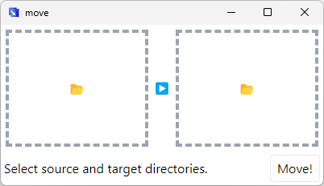

#  move

move (Multiple Objects Vault Efficiently)

move is a desktop application that allows you to move multiple files from one location to another. It is designed for organizing a lot of images.

